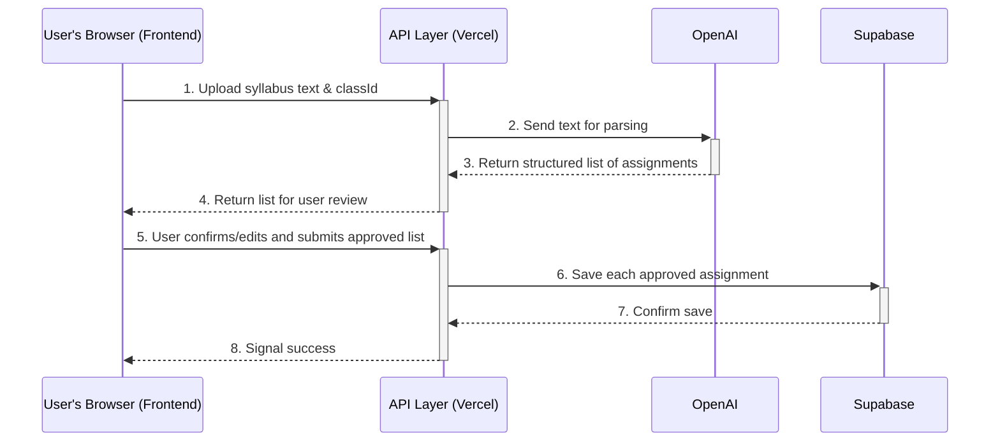
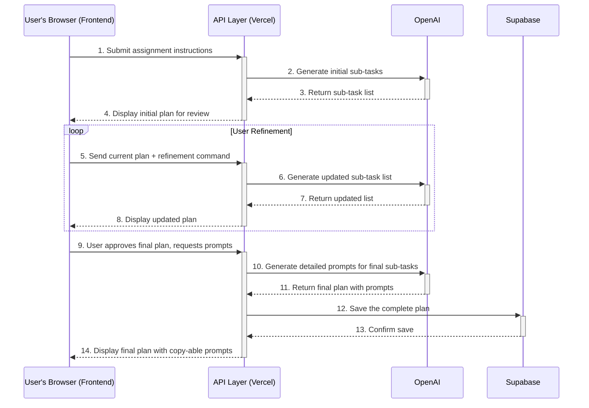

# Core Workflows

## Syllabus Parsing Workflow

```mermaid
sequenceDiagram
    participant Browser as User's Browser (Frontend)
    participant API as API Layer (Vercel)
    participant OpenAI
    participant Supabase
    Browser->>+API: 1. Upload syllabus text & classId
    API->>+OpenAI: 2. Send text for parsing
    OpenAI-->>-API: 3. Return structured list of assignments
    API-->>-Browser: 4. Return list for user review
    Browser->>+API: 5. User confirms/edits and submits approved list
    API->>+Supabase: 6. Save each approved assignment
    Supabase-->>-API: 7. Confirm save
    API-->>-Browser: 8. Signal success
```

## Interactive Assignment Plan Generation Workflow

```mermaid
sequenceDiagram
    participant Browser as User's Browser (Frontend)
    participant API as API Layer (Vercel)
    participant OpenAI
    participant Supabase
    Browser->>+API: 1. Submit assignment instructions
    API->>+OpenAI: 2. Generate initial sub-tasks
    OpenAI-->>-API: 3. Return sub-task list
    API-->>-Browser: 4. Display initial plan for review
    loop User Refinement
        Browser->>+API: 5. Send current plan + refinement command
        API->>+OpenAI: 6. Generate updated sub-task list
        OpenAI-->>-API: 7. Return updated list
        API-->>-Browser: 8. Display updated plan
    end
    Browser->>+API: 9. User approves final plan, requests prompts
    API->>+OpenAI: 10. Generate detailed prompts for final sub-tasks
    OpenAI-->>-API: 11. Return final plan with prompts
    API->>+Supabase: 12. Save the complete plan
    Supabase-->>-API: 13. Confirm save
    API-->>-Browser: 14. Display final plan with copy-able prompts
```